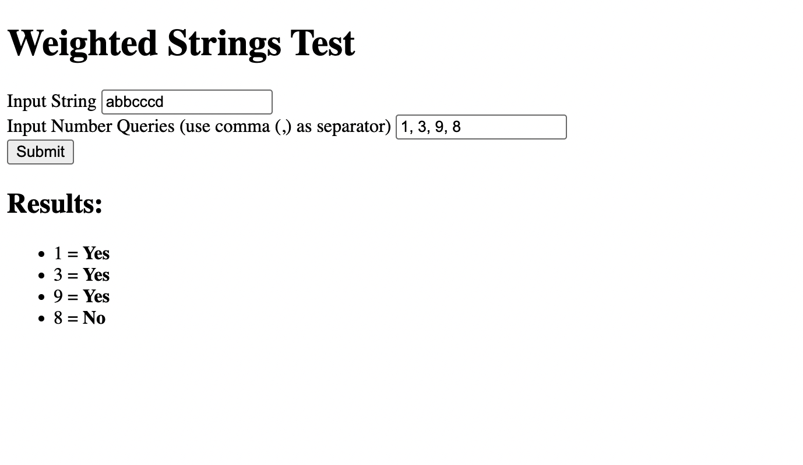

# 1. Weighted Strings

# 2. Balanced Bracket

- Time Complexity: O(n)
  The proccess iterates through each character in the input string once. Each operation inside the loop (checking bracket type, pushing/popping from stack) takes constant time O(1). So the total time grows based on the input size.

- Space Complexity: O(n)
  The stack stores all opening brackets, which can be up to n elements. str_split($s) creates an array of size n. so, the memory usage grows linearly with the input size.